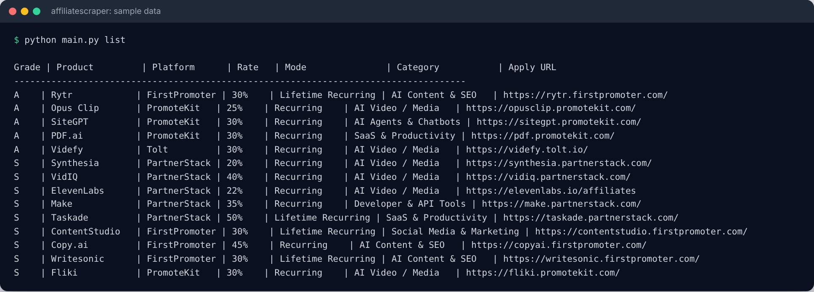
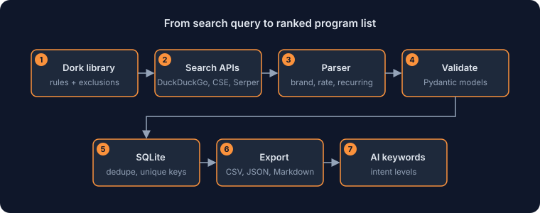

# AffiliateScraper

[English](README.md) · [中文](README.zh.md) · [Español](README.es.md) · [Deutsch](README.de.md) · Français

🌐 Feeds **[affproof.com](https://affproof.com)** · [GitHub @frommmmmg](https://github.com/frommmmmg)

> **Ce dépôt est une vitrine, pas une publication de code source.** AffiliateScraper n'est pas open source : il n'y a donc pas de code ici, seulement ce qu'il fait, comment il est construit et à quoi il ressemble. Pour en discuter, contactez-moi via mon [profil GitHub](https://github.com/frommmmmg).

**Un radar des programmes d'affiliation qui valent la peine.** Il trouve les programmes en libre-service que des entreprises SaaS et IA indépendantes hébergent sur des plateformes comme Tolt, Rewardful, PromoteKit, FirstPromoter et PartnerStack, plutôt que les grandes places de marché fermées.

Les programmes qui paient le mieux sont rarement dans une place de marché. Ils se trouvent sur la page d'inscription de l'entreprise elle-même, et chaque plateforme d'hébergement laisse une empreinte reconnaissable dans ses URL et ses formulations. AffiliateScraper transforme ces empreintes en règles de recherche, puis fait la partie fastidieuse : il lit ce qu'il trouve, extrait les conditions de commission, note chaque programme et range tout sous une forme qu'une personne peut filtrer, exporter et vérifier.

| | |
|---|---|
| **Mon rôle** | Conçu et construit par une seule personne, comme l'étape de découverte du pipeline de données d'AffProof |
| **Statut** | Utilisé au quotidien |
| **Sortie** | Exports CSV, JSON et Markdown, plus une couche de mots-clés pour décider quoi écrire |
| **Technologies** | Python · SQLite · Pydantic · API de recherche (DuckDuckGo, Google CSE, Serper) |

### Ce qu'il fait

**Découverte**
- **Recherche par dorks.** Une bibliothèque entretenue de règles de recherche, une famille par plateforme d'hébergement, avec des listes d'exclusion pour écarter blogs et sites d'avis. Les recherches passent par DuckDuckGo, Google CSE ou Serper, et les réglages de proxy sont configurables.
- **Visé sur les bons programmes.** Il cherche des commissions récurrentes de 30 % à 50 %, une approbation instantanée et un lien d'inscription public, pas des paiements ponctuels.

**Compréhension**
- **Analyse structurée.** Marque, taux de commission, récurrent ou ponctuel, durée du cookie, seuil de paiement, type d'approbation et catégorie sont extraits et validés par des modèles Pydantic.
- **Une note simple.** Niveaux S, A et B, où S désigne une commission récurrente d'au moins 30 % avec un fort potentiel de conversion.

**Stockage et sortie**
- **Stockage et export propres.** SQLite avec déduplication et contraintes d'unicité sur l'URL d'inscription, exporté en CSV, JSON et Markdown pour que les mêmes données s'ouvrent dans un tableur, un front end ou une note.

**Une couche de mots-clés**
- **De « qui me paie » à « que dois-je écrire ».** L'IA juge l'intention de recherche sans outils SEO payants et range les mots-clés en quatre niveaux, de ceux qui vont acheter à ceux qui sont simplement curieux. Les champs de volume, de concurrence et d'enchère sont réservés aux vraies données du Keyword Planner, car l'enchère d'un annonceur prouve que la demande est réelle.

## Captures d'écran

*Liste des programmes d'exemple en ligne de commande (données d'exemple publiques).*

## Comment ça marche

*De la requête de recherche à une liste de programmes classée et dédoublonnée.*

<!--notes-->
## Notes d'ingénierie

- **Une pile volontairement simple.** Python, SQLite et Pydantic, sans outil SEO payant dans la boucle : il tourne sur un portable et les données tiennent dans un seul fichier.
- **Une étape à la fois.** Chaque commande fait un travail et s'arrête. Rien n'enchaîne de lui-même l'étape suivante, ce qui laisse une personne maîtresse de ce qui entre dans la base.
- **Une vérification humaine pour chaque entrée.** La routine manuelle comporte trois étapes : confirmer qu'il s'agit d'une vraie page d'inscription indépendante, la noter selon ses conditions de commission et tester l'inscription pour voir si l'approbation est instantanée.
- **Une sortie lisible par d'autres outils.** CSV pour les tableurs, JSON pour les front ends et Markdown pour les notes, écrits à partir de la même table.
- **Construit pour alimenter quelque chose de plus grand.** C'est l'étape de découverte du pipeline d'AffProof, dont les étapes suivantes collectent les preuves, rédigent le dossier, le contrôlent, l'importent et le traduisent.

**Autres vitrines:** [AffProof](https://github.com/frommmmmg/AffProof-showcase) · [Tonu.app](https://github.com/frommmmmg/Tonu.app-showcase) · [AutoPin-CS](https://github.com/frommmmmg/AutoPin-CS-showcase)

---

Les captures n'utilisent que des données d'exemple ou publiques. © Tous droits réservés. Les descriptions peuvent être citées avec attribution ; le logiciel lui-même ne peut pas être redistribué.

